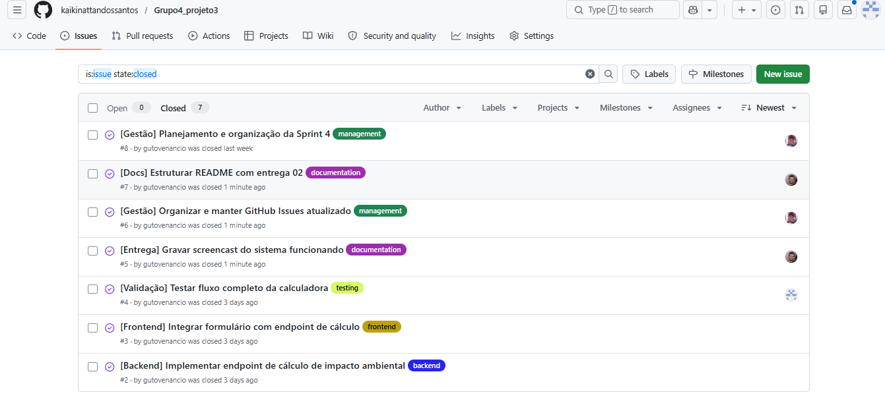
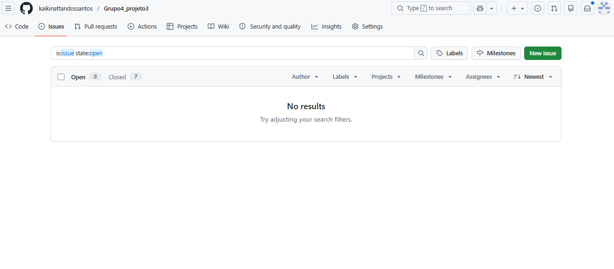
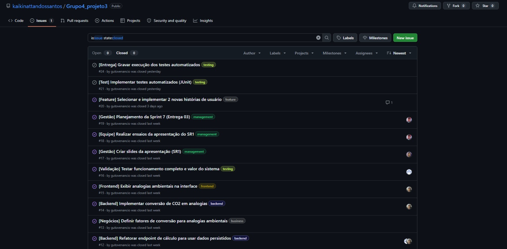
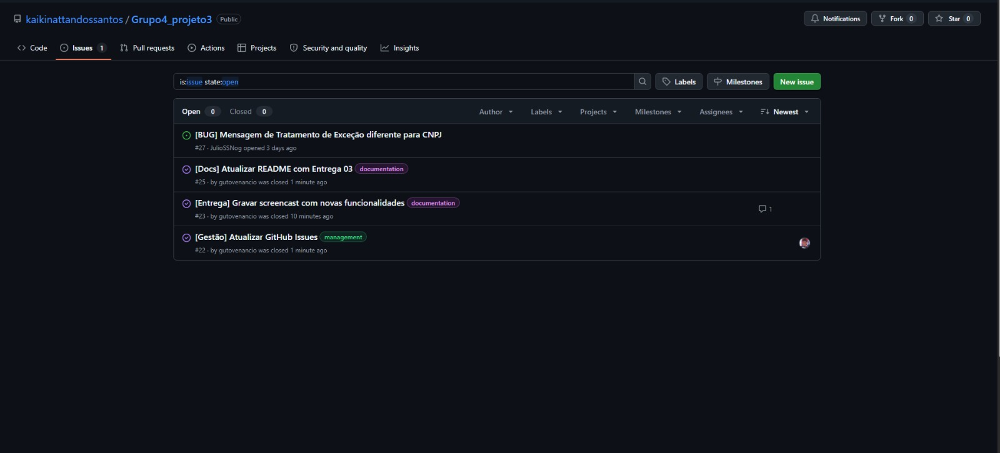
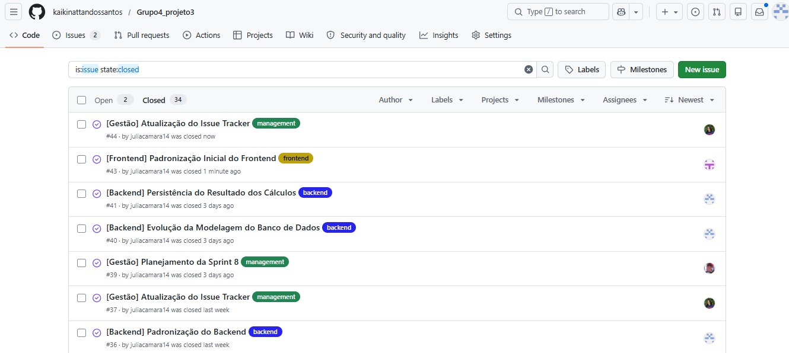
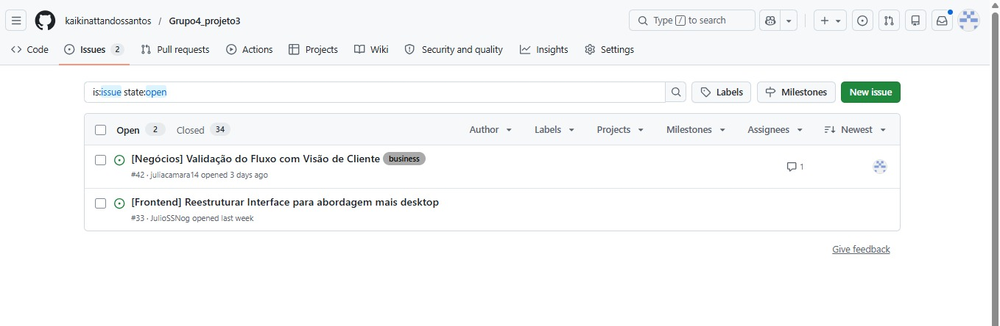

# 🌿 GreenPay Impact

## 📖 Sobre o Projeto

A GreenPay Impact é uma plataforma desenvolvida em parceria com a Edenred com o objetivo de demonstrar, de forma clara e mensurável, os benefícios ambientais da migração de pagamentos físicos para meios digitais.

A solução permite que a empresa simule diferentes cenários de digitalização, visualizem a redução de emissões de CO₂ e compreendam esse impacto através de analogias ambientais intuitivas, auxiliando iniciativas ESG e processos de tomada de decisão.

## 🎯 Problema

Embora a digitalização dos meios de pagamento seja uma realidade crescente, muitas empresas ainda possuem dificuldade em visualizar e comunicar o impacto ambiental positivo dessa transformação.

Nesse contexto, a GreenPay Impact busca responder à seguinte pergunta:

Quanto impacto ambiental uma empresa pode evitar ao migrar parte de suas transações físicas para meios digitais?

## 💡 Solução

A GreenPay Impact funciona como uma calculadora de impacto ambiental corporativa, permitindo que empresas comparem cenários físicos e digitais e obtenham indicadores claros sobre os benefícios ambientais da digitalização.

A plataforma utiliza fatores de emissão ambientais e equivalências ambientais para transformar números técnicos em informações facilmente compreensíveis.

## ✨ Principais Funcionalidades

### 📊 Dashboard Ambiental
Visualização consolidada dos principais indicadores ambientais calculados pela plataforma.

### 🧮 Simulação de Impacto Ambiental
Comparação entre transações físicas e digitais com base em fatores de emissão parametrizados.

### 🌳 Analogias Ambientais
Conversão dos resultados em equivalências mais intuitivas:

Árvores plantadas
Quilômetros de carro evitados
Garrafas PET equivalentes

### 📈 Simulação Percentual de Migração Digital
Permite simular cenários mais realistas, considerando migrações parciais das transações físicas para meios digitais.

### 🕒 Histórico de Simulações
Consulta de análises realizadas anteriormente.

### 📄 Exportação de Relatórios
Exportação dos resultados em:

PDF
CSV

### ⚙️ Gestão de Fatores de Emissão

Atualização dinâmica dos fatores ambientais utilizados nos cálculos.

## 🎥 Demonstração da Solução
Screencast Final

🔗 [INSERIR LINK DO SCREENCAST FINAL]

O vídeo demonstra o fluxo completo da plataforma, incluindo:

Landing Page
Simulação de impacto
Analogias ambientais
Histórico
Exportação PDF
Exportação CSV
Simulação percentual de migração digital


## 🏗️ Arquitetura da Solução

O projeto foi desenvolvido seguindo uma arquitetura em camadas baseada em Spring Boot.

Entidades Principais
Empresa

Armazena os dados empresariais utilizados nas simulações.

ResultadoCalculo

Responsável por registrar e manter o histórico de todos os cálculos realizados.

FatorEmissao

Armazena os fatores ambientais utilizados nos cálculos, permitindo rastreabilidade e atualização das metodologias.

FatorConversaoAnalogia

Responsável pelas equivalências ambientais utilizadas nas analogias apresentadas ao usuário.

## 🌎 Metodologia Ambiental

A GreenPay Impact utiliza fatores de emissão estimados com base em referências como:

IPCC
GHG Protocol
Mastercard
IDEMIA
Thales
Fator Físico
0,0005 kg CO₂ por transação
Fator Digital
0,00002 kg CO₂ por transação
Analogias Ambientais

As emissões evitadas são convertidas em:

Árvores equivalentes
Quilômetros de carro evitados
Garrafas PET equivalentes

O objetivo é tornar os resultados mais compreensíveis para usuários corporativos.

## 🛠️ Tecnologias Utilizadas
Backend
Java 25
Spring Boot 3.5
Spring Data JPA
Hibernate
PostgreSQL
Maven
Frontend
HTML5
CSS3
JavaScript ES6
Gestão e Colaboração
GitHub
GitHub Issues
ClickUp
Figma
Canva

---

## 👥 Equipe

Para uma melhor qualidade e eficiência no nosso projeto dividimos nossa equipe em 3 grupos sendo eles o de Negócios, Tech e Gestão

### 💼 Negócios
  Responsável por pesquisa de mercado, definição do problema, levantamento de requisitos e construção da proposta de valor do projeto
- André (**afg@cesar.school**)
- Danilo (**dmd@cesar.school**)
- Júlia (**jmc3@cesar.school**)

### 💻 Tech
  Responsável pelo desenvolvimento técnico do projeto, incluindo protótipos, experimentação de tecnologias e implementação das funcionalidades
- Caio (**cme@cesar.school**)
- Kaiki (**knsg@cesar.school**)
- Júlio (**jssn@cesar.school**)

### 📈 Gestão
  Responsável pelo acompanhamento do projeto, organização das entregas, planejamento e comunicação entre os membros da equipe.
- Venâncio (**avvn@cesar.school**)
- Victor (**vlns@cesar.school**)

---

## 📋 Processo de Desenvolvimento

O projeto foi desenvolvido utilizando uma divisão organizacional baseada em três frentes:

Gestão

Responsável pelo planejamento das sprints, acompanhamento das entregas e organização geral do projeto.

Negócios

Responsável pela pesquisa dos fatores ambientais, validações com cliente, levantamento de requisitos e construção da proposta de valor.

Tech

Responsável pela implementação técnica da solução, modelagem de dados, desenvolvimento da API e construção da interface.

---
## ⚙️ Fluxo de Versionamento
Para nosso projeto utilizamos baseado em Git Flow Simplificado e Commits Semânticos para uma organização completa do nosso repositório

1. Modelo de Ramificações (Branching Model)

  - `main`: Branch principal e estável, representando o ambiente de produção (MVP). Não são permitidos commits diretos nesta branch. Todo o código deve ser integrado obrigatoriamente via Pull Request, vindo exclusivamente da branch `develop` ou de um `hotfix`.

- `develop`: Branch de integração e homologação. É o ambiente principal de desenvolvimento onde todas as novas funcionalidades se encontram para testes em conjunto antes de irem para a `main`. Commits diretos não são permitidos, necessitando de um Pull Request.

- `feature/`: Utilizada para o desenvolvimento de novas funcionalidades, modelos de dados ou telas. 
  - Regra: Sempre deve ser criada a partir da `develop` e, após a conclusão, o Pull Request deve ser feito de volta para a `develop`.
    - Exemplo: `feature/heatmap-controller`
  
- `bugfix/` ou `hotfix/`: Utilizadas para correções de falhas, bugs e ajustes críticos, com destinos diferentes dependendo da urgência:
  - `bugfix/`: Erros encontrados durante o desenvolvimento ou testes. Ramifica da `develop` e retorna para a `develop`.
  - `hotfix/`: Erros críticos encontrados em produção. Ramifica da `main` e, após corrigido, o Pull Request deve ser enviado para a `main` e também para a `develop` (para garantir que o erro não volte nas próximas atualizações).
    - *Exemplo:* `bugfix/correcao-layout-solicitacao` ou `hotfix/queda-servidor-banco`

2. Padrão de Commits Semânticos

    As mensagens de commit devem ser objetivas e indicar a natureza da alteração, utilizando os seguintes prefixos obrigatórios:
  
    - `feat`: Inclusão de uma nova funcionalidade ou recurso.
    - `fix`: Correção de um bug ou comportamento inesperado no sistema.
    - `style`: Alterações puramente visuais (HTML/CSS) ou de formatação que não afetam a regra de negócio.
    - `docs`: Criação ou atualizações na documentação e comentários do código.

3. Ciclo de Desenvolvimento
   
    O nosso ciclo de desenvolvimento foi desenhado para proteger a estabilidade do sistema e facilitar a colaboração entre toda a equipe,cada nova implementação deve seguir estes passos:

    1. **Sincronização:** Garanta que seu repositório local está sincronizado com a branch de integração (`git checkout develop` seguido de `git pull origin develop`).
    2. **Ramificação:** Crie a branch específica para a sua tarefa a partir da `develop` (ex: `git checkout -b feature/nome-da-tarefa`).
    3. **Desenvolvimento:** Realize as alterações necessárias e efetue os commits seguindo o padrão semântico definido.
    4. **Pull Request (PR):** Após a conclusão da tarefa, envie sua branch para o repositório remoto (`git push origin feature/nome-da-tarefa`) e abra um Pull Request apontando de volta para a branch `develop`.
    5. **Code Review e Merge:** O código deve ser revisado por ao menos um outro membro da equipe. Após a aprovação, o merge é realizado e a branch de feature pode ser descartada
    6. **Lançamento (Release para a Main):** Quando a branch `develop` acumular um conjunto de funcionalidades estáveis e testadas, é aberto um Pull Request final da `develop` para a `main`. Após a aprovação deste merge, a nova versão do sistema entra oficialmente em produção (MVP).

---

### 🚀 Requisitos e Como Executar

####  Pré-requisitos Técnicos
Antes de rodar a aplicação localmente, certifique-se de ter instalado em sua máquina:
* **Java JDK 21**: Ambiente de execução e compilação da API Spring Boot.
* **Maven 3.8+**: Gerenciador de dependências (opcional, visto que o projeto já inclui o utilitário nativo `mvnw`).
* **PostgreSQL**: Banco de dados relacional para a persistência e rastreabilidade das simulações.

####  1. Configuração do Banco de Dados
A aplicação utiliza persistência automatizada e parametrização dinâmica de dados. Antes de iniciar o servidor, configure o seu ambiente local no PostgreSQL:

1. Crie um banco de dados vazio com o nome exato de: `edenred_db`
2. Certifique-se de que as credenciais do seu serviço PostgreSQL correspondem às configurações padrão do projeto:
   * **Usuário:** `postgres`
   * **Senha:** `3456`

> ** Nota de Praticidade:** Não é necessário executar nenhum script SQL manual para criar tabelas ou inserir registros iniciais. Graças à propriedade `ddl-auto=update` do Spring Data JPA e ao componente automático `DataInitializer`, toda a estrutura relacional (tabelas de empresas, histórico de resultados de cálculos, fatores de emissão e analogias científicas) é gerada e populada com os dados de referência no exato momento em que a aplicação é iniciada pela primeira vez.

####  2. Como Executar a Aplicação

1. Abra o seu terminal e navegue até a pasta raiz do projeto:
```bash
cd calculadora
```
2. Certifique-se de que o serviço do seu PostgreSQL está ativo e rodando em segundo plano.
3. Execute o comando do Maven Wrapper para compilar o ecossistema e iniciar o servidor embutido do Spring Boot:
```bash
./mvnw spring-boot:run
```
4. Aguarde a mensagem de confirmação no console indicando que o Tomcat foi iniciado com sucesso na porta **8081**.

####  3. Acesso à Interface do Usuário

Com o servidor backend ativo, abra o seu navegador de preferência e acesse o endereço do ecossistema modular:
```url
http://localhost:8081/
```
*(Caso queira acessar o arquivo estático diretamente pelo mapeamento, utilize: `http://localhost:8081/index.html`)*

---

## Entrega 1

  ### Histórias do Usuário
  
  [link para o FigJam](https://www.figma.com/board/lZy6lebsYlZyLumOq8trZp/FigJam-Projetos-3?node-id=267-34&p=f&t=jocHJL0BniD9Rgao-0)
  
  ### Protótipo Lo-Fi
  [link para o Figma](https://www.figma.com/proto/fqkOwTo6V06bIYWxXAWMGQ/Sem-t%C3%ADtulo?node-id=1-2&t=qqkqD9rIfS0p9XTp-1&scaling=min-zoom&content-scaling=fixed&page-id=0%3A1&starting-point-node-id=1%3A2)
  
  ### Screencast Lo-Fi
  [link para o Screencast Lo-Fi](https://youtu.be/W4GPjuBF4Xc)

---

## Entrega 2

  ### Issue/Bug Tracker
  O acompanhamento das tarefas foi feito pelo GitHub Issues, onde registramos e finalizamos todas as atividades desta entrega. O quadro está 100% concluído, sem pendências abertas.
  #### Organização por Categorias
Para garantir a rastreabilidade das alterações e a organização das responsabilidades, as tarefas foram segmentadas através de etiquetas específicas:

`backend`: Implementação das regras de negócio, persistência de dados e cálculo de impacto em Java.

`frontend`: Desenvolvimento da interface web e integração de conectividade via API.

`testing & validation`: Baterias de testes do fluxo completo para garantir a acurácia dos cálculos.

`documentation`: Estruturação técnica do README e suporte aos materiais de entrega.

`management`: Planeamento das sprints e controlo de organização do repositório.
  #### Evidências
  **Histórico de tarefas finalizadas:**


**Quadro de atividades atual:**


  ### Screencast 2
  [link para o Screencast](https://youtu.be/1URsS2YSoAY)

---

## Entrega 3
  
  ### Novas Funcionalidades
  Nesta entrega, focamos em transformar a calculadora numa ferramenta consultiva para os executivos da Edenred, implementando:
  - **Histórico de Cálculos:** Visualização de simulações passadas com capacidade de revisualização de dados.
  - **Relatório Executivo (PDF):** Exportação limpa e profissional dos resultados e analogias para apresentação a clientes B2B.

  ### Issue/Bug Tracker
  O acompanhamento das tarefas foi feito novamente pelo GitHub Issues, estamos sempre utilizando ele como referência e incentivando o uso ativo.
  
  **Histórico de tarefas finalizadas:**


**Quadro de atividades atual:**


  ### Screencast 3
  [link para o Screencast](https://youtu.be/5nE5RElzUXQ)
  
  ---

 ## Entrega 4
  
### Evolução da Plataforma
Nesta etapa, consolidamos a maturidade arquitetural da calculadora e aprimoramos as ferramentas de auditoria ESG e usabilidade B2B para os executivos da Edenred, implementando:
- **Busca Instantânea no Histórico:** Inclusão de um filtro reativo em tempo real (`onkeyup`) na modal de listagem, permitindo localizar análises passadas de forma ágil digitando apenas trechos do Nome Fantasia ou CNPJ da empresa.
- **Parametrização Dinâmica de Fatores & Analogias:** Migração completa das métricas e equivalências científicas (árvores, quilômetros e garrafas PET) de constantes chumbadas (*hardcoded*) no código para tabelas dedicadas no PostgreSQL, viabilizando atualizações de conformidade sem necessidade de novos *deploys*.
- **Histórico Automático & Persistência:** Persistência permanente de toda simulação realizada na tabela do banco, congelando a fotografia exata dos fatores vigentes no milissegundo do cálculo para garantir rastreabilidade à auditoria.
- **Gestão e Atualização de Fatores de Emissão:** Criação de um painel administrativo para inserção de novos referenciais científicos e metodologias (ex: GHG Protocol). O sistema arquiva automaticamente as versões obsoletas (*soft delete*), mantendo a integridade e rastreabilidade dos cálculos antigos.


  ### Issue/Bug Tracker
  O acompanhamento das tarefas foi feito novamente pelo GitHub Issues, estamos sempre utilizando ele como referência e incentivando o uso ativo.
  
  **Histórico de tarefas finalizadas:**


**Quadro de atividades atual:**


  ### Screencast 4
  [link para o Screencast](https://youtu.be/51KsWhH2UIw?si=riOcFOz8eDW5vQ3p)

## 📄 Licença

Projeto acadêmico desenvolvido para a disciplina Projeto 3 da CESAR School em parceria com a Edenred.
